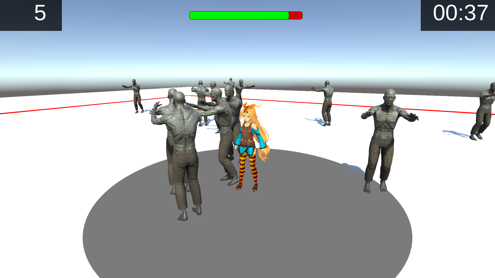

# ゲームジャム概要

- 大学研究室開催(非公式)
- 時間：10:00 - 20:00
- テーマ：孤独

# ゲーム内容

## プレイ画面

## 概要

- ユニティちゃんはさみしがり屋なので周りにある程度人がいないと傷ついてしまう
- ということで、周りにゾンビが 3 体いる状態をなるべく維持するように移動していくゲーム
- 足元のグレーのエリア内が近く判定になり、この中にゾンビが 3 体以上いないと画面上部の HP バーが減少していき、0 になったらゲームオーバー
- 生き残った時間を長くするのが目標となる

## 操作

- マウス：カメラ回転
- 「w, a, s, d」：自キャラ移動
- 「Enter」：ゲーム開始、リザルトから初期画面への遷移
